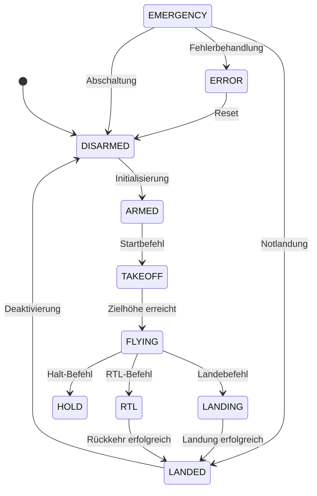

# Flugphasen und Entwicklungsphasen

## Einleitung

Dieses Dokument beschreibt zwei verschiedene Arten von Phasen im RZGCS-System:

1. **Flugphasen**: Die verschiedenen Zustände, die ein UAV während des Fluges durchläuft
2. **Entwicklungsphasen**: Die verschiedenen Entwicklungsstufen des Gesamtsystems

## Flugphasen

Die Flugphasen beschreiben die verschiedenen Zustände, die ein UAV während des Fluges durchläuft. Diese Phasen sind Teil der grundlegenden Flugsteuerung und werden in allen Entwicklungsphasen verwendet.

### Übersicht der Flugphasen

1. **DISARMED**
   - System ist ausgeschaltet oder deaktiviert
   - Motoren aus
   - Keine aktive Steuerung
   - Sicherheitsüberwachung aktiv

2. **ARMED**
   - System ist aktiviert und bereit für den Start
   - Motoren aktiviert
   - Steuerung bereit
   - Alle Systeme geprüft

3. **TAKEOFF**
   - System befindet sich im Startvorgang
   - Motoren auf Startleistung
   - Steigflug aktiv
   - Startsequenz läuft

4. **FLYING**
   - System ist im normalen Flugbetrieb
   - Normale Flugsteuerung
   - Missionsausführung möglich
   - Telemetrie aktiv

5. **LANDING**
   - System befindet sich im Landeanflug
   - Sinkflug aktiv
   - Landesequenz läuft
   - Höhenüberwachung aktiv

6. **LANDED**
   - System ist gelandet
   - Motoren aus
   - System im Standby
   - Telemetrie aktiv

7. **ERROR**
   - System befindet sich in einem Fehlerzustand
   - Fehlerbehandlung aktiv
   - Eingeschränkte Funktionalität
   - Fehlerprotokollierung aktiv

8. **EMERGENCY**
   - System befindet sich im Notfallmodus
   - Notfallprozeduren aktiv
   - Maximale Sicherheit
   - Sofortige Reaktion

### Phasenübergänge

## Entwicklungsphasen

Die Entwicklungsphasen beschreiben die verschiedenen Stufen der Systementwicklung. Jede Phase baut auf der vorherigen auf und erweitert die Funktionalität des Systems.

### Phase 3: Erweiterte Integration
- Multi-UAV Unterstützung
- Erweiterte Sensorintegration
- Erweiterte Kommunikation
- Erweiterte Benutzeroberfläche

### Phase 4: Autonomie und KI
- Autonome Flugsteuerung
- Erweiterte Missionsplanung
- Erweiterte Diagnose
- Erweiterte Sicherheit

## Integration der Phasen

Die Flugphasen sind die Grundlage für alle Entwicklungsphasen. Während die Flugphasen die grundlegende Funktionalität beschreiben, erweitern die Entwicklungsphasen diese um zusätzliche Features:

- **Phase 3** erweitert die Flugphasen um Multi-UAV-Funktionalität und erweiterte Sensorik
- **Phase 4** fügt KI-basierte Entscheidungsfindung und autonome Steuerung hinzu

## Implementierungshinweise

### Status-Überprüfung
- Regelmäßige Überprüfung der Phasenübergänge
- Validierung der Übergangsbedingungen
- Protokollierung von Phasenwechseln

### Sicherheit
- Keine unerlaubten Phasenübergänge
- Überprüfung aller Bedingungen vor Übergängen
- Notfallprozeduren für kritische Situationen

### Telemetrie
- Kontinuierliche Überwachung der Flugparameter
- Protokollierung aller Phasenwechsel
- Echtzeit-Statusmeldungen

## Fehlerbehandlung

### Fehlerkategorien
1. **Kritische Fehler**
   - Sofortige Notfallprozedur
   - Übergang in EMERGENCY-Phase
   - Systemabschaltung wenn nötig

2. **Nicht-kritische Fehler**
   - Übergang in ERROR-Phase
   - Versuch der Fehlerbehebung
   - Gegebenenfalls sichere Landung

### Fehlerprotokollierung
- Zeitstempel
- Fehlertyp
- Aktuelle Phase
- Durchgeführte Aktionen
- Ergebnis der Fehlerbehandlung 